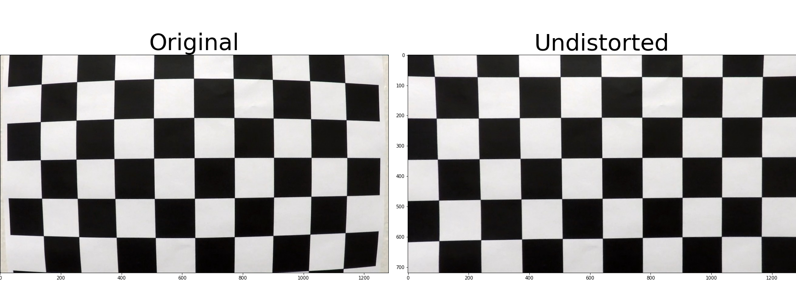
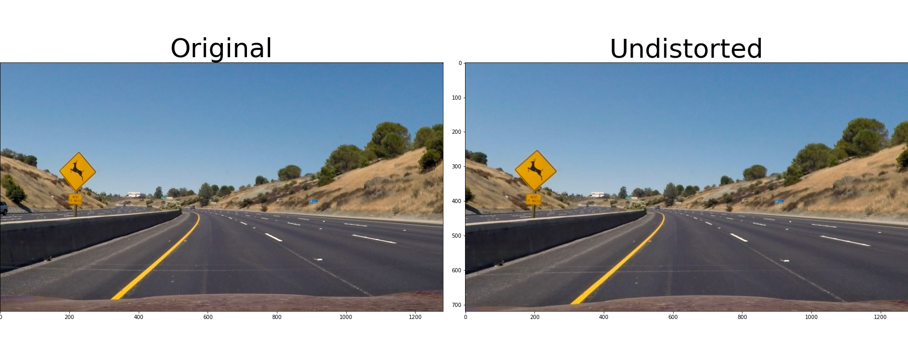
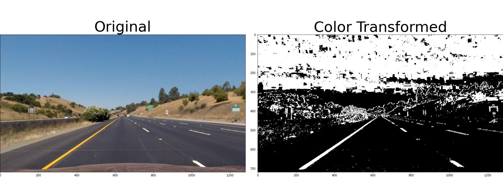
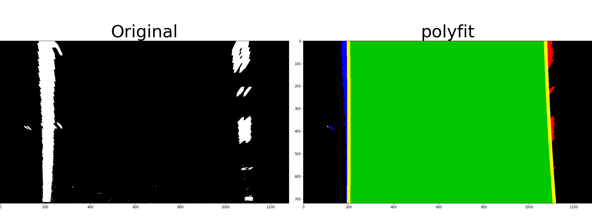
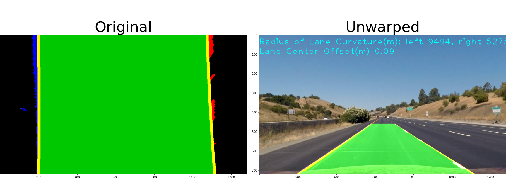
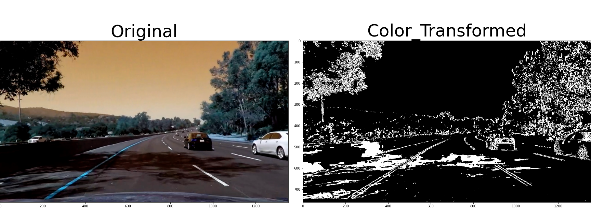

**Advanced Lane Finding Project**

The goals / steps of this project are the following:

* Compute the camera calibration matrix and distortion coefficients given a set of chessboard images.
* Apply a distortion correction to raw images.
* Use color transforms, gradients, etc., to create a thresholded binary image.
* Apply a perspective transform to rectify binary image ("birds-eye view").
* Detect lane pixels and fit to find the lane boundary.
* Determine the curvature of the lane and vehicle position with respect to center.
* Warp the detected lane boundaries back onto the original image.
* Output visual display of the lane boundaries and numerical estimation of lane curvature and vehicle position.

---
### Camera Calibration

The code for calibration is between lines #17 through #60.

I start by preparing "object points", which will be the (x, y, z) coordinates of the chessboard corners in the world. Here I am assuming the chessboard is fixed on the (x, y) plane at z=0, such that the object points are the same for each calibration image.  Thus, `objp` is just a replicated array of coordinates, and `objpoints` will be appended with a copy of it every time I successfully detect all chessboard corners in a test image.  `imgpoints` will be appended with the (x, y) pixel position of each of the corners in the image plane with each successful chessboard detection.  

I then used the output `objpoints` and `imgpoints` to compute the camera calibration and distortion coefficients using the `cv2.calibrateCamera()` function and store the resulting camera matrix `mtx` and distortion coefficient `dist`.  I applied this distortion correction to the test image using the `cv2.undistort()` function and obtained this result:



I also have the camera matrix and distortion coefficient ready and provide a wrapper function for later use.
```
mtx = [[1.15777930e+03 0.00000000e+00 6.67111054e+02]
    [0.00000000e+00 1.15282291e+03 3.86128938e+02]
    [0.00000000e+00 0.00000000e+00 1.00000000e+00]]

dist_coefficient = [[-0.24688775 -0.02373132 -0.00109842  0.00035108 -0.00258571]]
```

### Pipeline (single images)

#### 1. Provide an example of a distortion-corrected image.

To demonstrate this step, I will describe how I apply the distortion correction to one of the test images like this one:


#### 2. Describe how (and identify where in your code) you used color transforms, gradients or other methods to create a thresholded binary image.  Provide an example of a binary image result.

I used a combination of color and gradient thresholds to generate a binary image (thresholding steps in function *transform_color* at lines #98 through #125).  Here's an example of my output for this step. I combined RGB and HLS models by running scaled sabel x on on grayscale images and combining with S channel and filtering by a threshold for each.


#### 3. Describe how (and identify where in your code) you performed a perspective transform and provide an example of a transformed image.

The code for my perspective transform includes a function called `transform_perspective(bin_image, reverse=False)`, which takes an image, and a flag to identify if a reverse/unwrap should be performed used for the last step.

Here's the region I manually selected.
```python3
    (height, width) = bin_image.shape[:2]
    offset = 100
    src_region = np.float32([
        [width / 2 - offset + 40, height / 2 + offset],
        [width / 2 + offset - 30, height / 2 + offset],
        [width - offset - 50, height],
        [offset + 95, height],
    ])

    # leave enough space for curvature
    dest_region = np.float32([
        [offset + 95, 0],
        [width - offset - 50, 0],
        [width - offset - 50, height],
        [offset + 95, height],
     ])
```

This resulted in the following source and destination points:

| Source        | Destination   |
|:-------------:|:-------------:| 
| 580, 460      | 195, 0        | 
| 710, 460      | 1130, 0      |
| 1130, 720     | 1130, 720      |
| 195, 720      | 195, 720        |

I verified that my perspective transform was working as expected by drawing the `src` and `dst` points onto a test image and its warped counterpart to verify that the lines appear parallel in the warped image.


#### 4. Describe how (and identify where in your code) you identified lane-line pixels and fit their positions with a polynomial?

In the *fit_polynomial(binary_warped, decorate_orig=False)* function, I used both sliding windows and search from previous image's polynomial to identify lane-line pixels by maintaining a copy of the previous fits. I also drew the pixels detected along with the lane-line to demonstrate that the poly fit is correct.



#### 5. Describe how (and identify where in your code) you calculated the radius of curvature of the lane and the position of the vehicle with respect to center.

The code is in function *draw_curvature_stats* at line #342.

To calculate the radius of curvature of lanes, I used the detected lane-line pixels and scaled them to match the real-world size and then run polyfit again to get the fitted lines. I then ran the formula with the polyfit as input
```python3
    left_curverad = np.power(1 + (2 * left_fit_cr[0] * max(ploty_cr) + left_fit_cr[1]) ** 2, 3/2) / np.abs(2 * left_fit_cr[0])
    right_curverad = np.power(1 + (2 * right_fit_cr[0] * max(ploty_cr) + right_fit_cr[1]) ** 2, 3/2) / np.abs(2 * right_fit_cr[0])
```

I calculated the position shift from center of lane based on the assumption that the camera is fixed in the middle of the car top. As the left and right lane lines are both detected, I used the starting points for each to get the middle of the detected lanes and compared with the horizontal middle of the image. As I calculated the stats on the wrap image, I saved the result locally and applied it to the final unwrapped image.

#### 6. Provide an example image of your result plotted back down onto the road such that the lane area is identified clearly.

I reused the *transform_perspective* function to unwrap the region back to the original image with additional lane-lines drawn on top. 



---

### Pipeline (video)

#### 1. Provide a link to your final video output.  Your pipeline should perform reasonably well on the entire project video (wobbly lines are ok but no catastrophic failures that would cause the car to drive off the road!).

Here's a [link to the pipeline result for the project video](https://youtu.be/jrHBYlUt0CY)

---

### Discussion
1. I used the both sliding windows and polyfit from a previous frame to speed up the pixel finding. It would go south if in a frame, there's no good amount of pixels for a lane as it would impact following frame.

2. S channel works great in the lecture 7-12 but it produces a lot of noises in a few frames of project_video. It would be great to have a feedback on how the chosen channel contributes to final lane-lines, for example, number of points to make to the final lane-lines. This we can maintain a running weight of the contribution of each channel and thus produce less noisy lane lines.
   